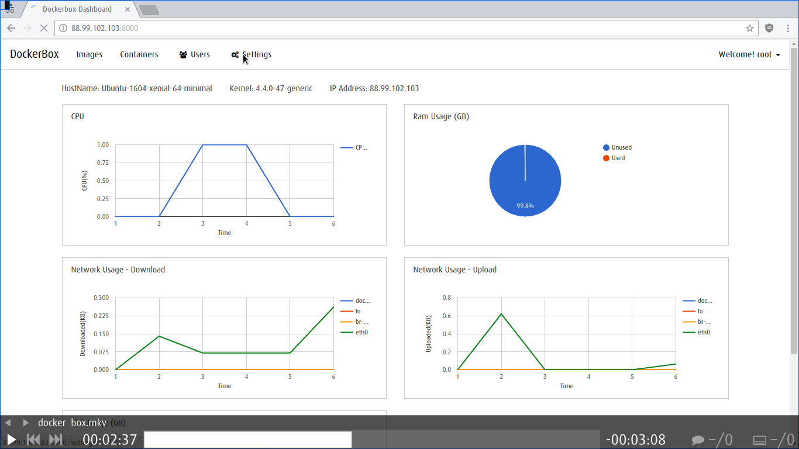

# docker-box

### Reason for creating this tool:
Consider a server with multiple IP Addresses, we create virtual machines, assign IP addresses to these machines, provide access to users etc.., most of the time the purpose of these virtual machines is to deploy applications eigther for testing or production.
In the case of testing we aren't bothered about security or reliability of the host on which the application is running, so all that matters is time to setup testing environment, make backups, resetting the environment and so on.
So in this scenerio running docker containers from images which has init system is a best substitute for virtual machines.
docker-box is created to implement above use case using django for web interface and docker enginer api to manage docker.


### Features:
  - UI to run containers easily.
    - Minimal UI focusing on content.
    - Run a container in just 5 seconds.

  - Takes care of networking.
    - Just provide your desired IP, docker box will set it up for you.
    - Uses MACVLAN network which doesn’t mess up your iptables.

  - User management.
    - Create users and assign them to your virtual machine like container.
	- SSH access for user to the container.

  - Host and containers statistics.
    - Graphical view for your host and running containers.
	- Includes CPU, RAM, NETWORK and DISK.

  - Create backups of containers.
    - Just give a name and your backup will be ready in a couple of seconds.
	- Use these images as base to extend functionalities.

  - Web based terminal session for containers.
    - Get a quick access to your system using web based terminal.


### Installation
Run:
```sh
sudo curl -o /tmp/install.sh https://raw.githubusercontent.com/MicroPyramid/docker-box/master/install.sh && sudo chmod +x /tmp/install.sh && sudo bash /tmp/install.sh
```

Currently supports:
   - Ubuntu 16.04, 14.04
   - Debian Jessie, Wheezy
   - CentOS 7, 6


### DockerBox Workflow Video.

[](https://www.youtube.com/watch?v=YCjkZLBNxUQ "DockerBox")


License
----

MIT


Contact
----

[Micropyramid](https://micropyramid.com/docker-consulting).
