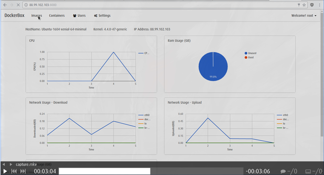

# docker-box

Running full blown OS as containers will suffice most of the virtual machine needs. So why not use containers just like regular virtual machines? There are security risks with this, they aren’t meant to run multiple services and moreover they are not reliable for storing data, however when you need to deploy a test environment or any environment where you care less about security and more about time, you can bring up full blown OS containers within 5-10 seconds instead of setting up virtual machines and you get all the benefits of containers like instantaneous backups(commits), easy start and stop and the awesome feature of pausing your container etc.

Why docker-box?
  - UI to run containers easily.
    - Minimal UI focusing on content.
    - Run a container in just 5 seconds.

  - Takes care of networking.
    - Just provide your desired IP, docker box will set it up for you.
    - Uses MACVLAN network which doesn’t mess up your iptables.<Paste>

  - User management.
    - Create users and assign them to your virtual machine like container.
	- SSH access for user to the container.

  - Host and containers statistics.
    - Graphical view for your host and running containers.
	- Includes CPU, RAM, NETWORK and DISK.

  - Create backups of containers.
    - Just give a name and your backup will be ready in a couple of seconds.
	- Use these images as base to extend functionalities.

  - Web based terminal session for containers.
    - Get a quick access to your system using web based terminal.


### Installation
Run:
```sh
sudo curl -o /tmp/install.sh https://raw.githubusercontent.com/MicroPyramid/docker-box/master/install.sh && sudo chmod +x /tmp/install.sh && sudo bash /tmp/install.sh
```

Currently supports:
   - Ubuntu 16.04, 14.04
   - Debian Jessie, Wheezy
   - CentOS 7, 6


### DockerBox Workflow.

[](https://www.youtube.com/watch?v=7tKSz5OkrA0 "DockerBox")


License
----

MIT
